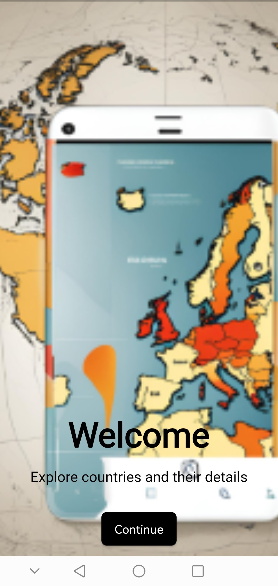
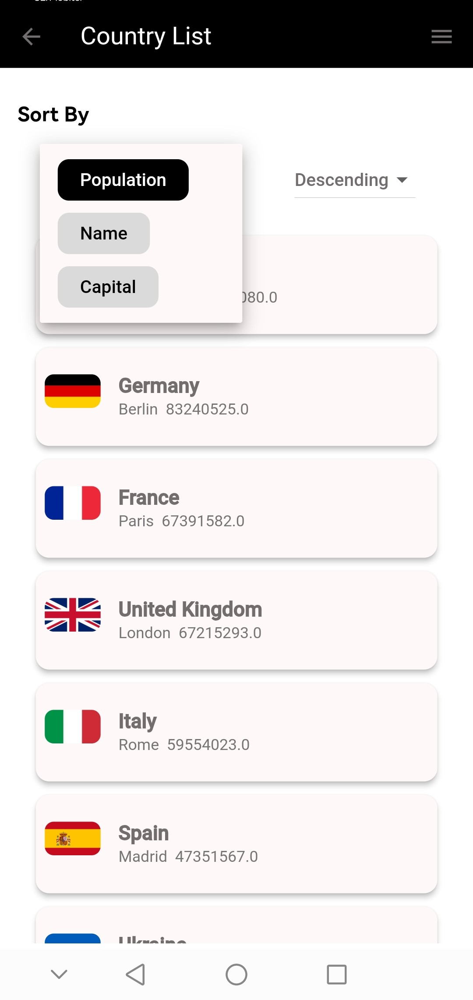

# Country List

## Description

Build a Flutter app that fetches and displays a list of European countries. The app allows users to sort the countries based on population, name, and capital, and display detailed information about a selected country.

## Features

- Fetch and display a list of European countries.
- Sort countries by population, name, and capital.
- View detailed information about a selected country.

## Setup

To get started with the project, follow these steps:

**Clone the Repository:**
cd repository
1 . flutter pub get
2 . flutter build runner build --delete-conflicting-outputs
3 . flutter run
